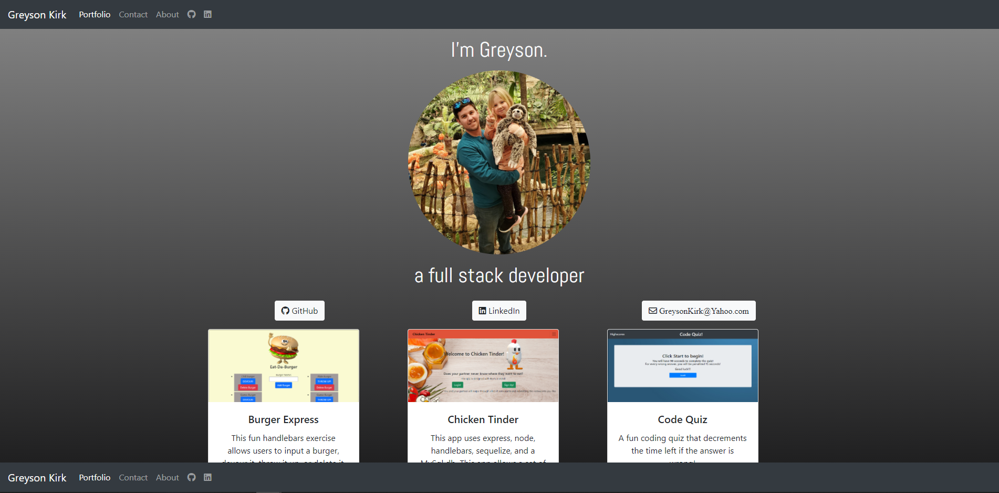
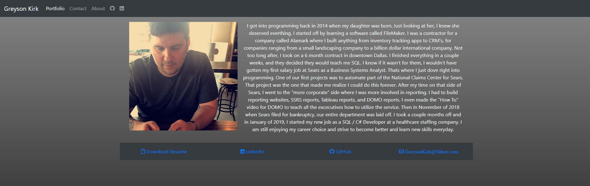

# Portfolio with React


 ### GitHub Repo: https://github.com/greysonkirk/ReactPortfolio
 ### Heroku Link:  https://nameless-wave-33506.herokuapp.com/

This portfolio is built using React and React Bootstrap. 

For the projects, I used a component called Project that consisted of a Bootstrap card and used the map funtion to display for each project. 
```javascript
   <Row>
          {repos.map((repo) => {
            return (
              <Col size="4">
                <Project {...repo}></Project>
              </Col>
            );
          })}
        </Row>
```



